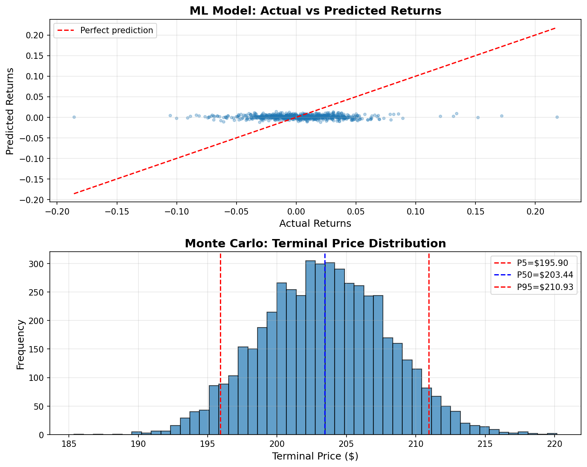

# finmc-tech

**Machine Learning + Monte Carlo Simulation for Tech Stock Forecasting with HPC parallelization and uncertainty quantification**

`finmc-tech` is a minimal prototype for real-world stock forecasting that combines **machine learning signals** with **Monte Carlo uncertainty modeling** and **HPC-ready parallel execution**.

The initial demo focuses on **NVIDIA (NVDA)** using real daily data from the Yahoo Finance API to compute returns, volatility, and rolling μ–σ parameters as inputs for simulation.

This project serves as the foundation for scaling to multi-asset (Magnificent 7) analysis, integrating predictive modeling, uncertainty quantification, and performance benchmarking.

## Results

**Full picture prices distribution** (NVDA 2010-2025):



- **Machine Learning Model** (Log Returns Prediction):
  - **Input**: **30-day rolling window** of log returns
  - **Output**: **1-day ahead** log return prediction
  - Train period: **2010-01-04 to 2022-09-15** (80% of data)
  - Test period: **2022-09-16 to 2025-10-31** (20% of data, 785 predictions)
  - R² Score: -0.02 (negative indicates worse than naive baseline)
  - Insight: Simple models struggle with noisy returns; advanced features needed

- **Monte Carlo Simulation** (Price Forecasting):
  - **Input**: **30-day rolling μ/σ** estimated from log returns (2025-09-30 to 2025-10-31)
  - **Output**: **252 trading days ahead** (1-year) price distribution
  - Starting date: **2025-10-31** (last trading day in dataset)
  - Starting price: **$202.49**
  - 5,000 simulated paths using Geometric Brownian Motion (GBM)
  - Terminal forecast (2026-10-31): **$185.36 - $220.18**
  - Key quantiles: P5=$195.90, P50=$203.44, P95=$210.93
  - HPC acceleration: Numba parallel backend (0.81s runtime)

## Features

- **Data Pipeline**: Yahoo Finance API integration for historical stock data
- **Monte Carlo Simulation**: Probability-based forecasting with configurable parameters
- **Uncertainty Quantification**: Statistical analysis of returns, volatility, and confidence intervals
- **HPC-Ready**: Parallel execution using multiprocessing for scalable performance
- **ML Integration**: Feature engineering and predictive modeling pipeline
- **Visualization**: Results analysis and forecasting plots

# Appendix

## Technology Stack

**Language**: Python 3.9+  
**Core Libraries**: NumPy, Pandas, SciPy  
**Data Source**: yfinance (Yahoo Finance API)  
**Machine Learning**: scikit-learn (RF, GBM, Ridge, Lasso)  
**Simulation**: Monte Carlo (GBM), Uncertainty Quantification  
**Parallelization**: joblib, multiprocessing, numba  
**Visualization**: Matplotlib, Seaborn  
**Testing**: pytest, black, flake8, Jupyter

## Project Structure

```
finmc-tech/
├── README.md
├── requirements.txt
├── setup.py
├── LICENSE
├── src/
│   ├── __init__.py
│   ├── data/
│   │   ├── __init__.py
│   │   └── fetch.py           # Yahoo Finance data fetching
│   ├── simulation/
│   │   ├── __init__.py
│   │   ├── monte_carlo.py     # Monte Carlo core
│   │   └── uncertainty.py     # Uncertainty quantification
│   ├── ml/
│   │   ├── __init__.py
│   │   ├── features.py        # Feature engineering
│   │   └── models.py          # ML models
│   ├── parallel/
│   │   ├── __init__.py
│   │   └── executor.py        # HPC parallel execution
│   └── visualization/
│       ├── __init__.py
│       └── plots.py           # Results visualization
├── examples/
│   └── quick_start.py         # Quick start example
├── notebooks/
│   └── demo_nvda.ipynb        # Demo notebook
└── tests/
    ├── __init__.py
    ├── test_data.py
    └── test_simulation.py
```

## Installation

```bash
# Clone the repository
git clone https://github.com/yixuan116/finmc-tech.git
cd finmc-tech

# Create virtual environment
python -m venv venv
source venv/bin/activate  # On Windows: venv\Scripts\activate

# Install dependencies
pip install -r requirements.txt

# Install package in development mode
pip install -e .
```

## Quick Start

```python
from src.data.fetch import fetch_stock_data
from src.simulation.monte_carlo import MonteCarloForecast

# Fetch NVIDIA data (default: 2010-2025)
data = fetch_stock_data("NVDA")

# Run Monte Carlo simulation
forecast = MonteCarloForecast(n_simulations=10000, days_ahead=30)
results = forecast.run(data)

# Analyze results
print(f"Expected Return: {results['expected_return']:.2%}")
print(f"95% Confidence Interval: [${results['ci_lower']:.2f}, ${results['ci_upper']:.2f}]")
```

Or run the quick start example:

```bash
python examples/quick_start.py
```

## Usage Examples

### Data Fetching

```python
from src.data.fetch import fetch_stock_data

# Fetch NVDA data (default: 2010-2025)
data = fetch_stock_data("NVDA")

# Custom date range
data = fetch_stock_data("AAPL", start="2020-01-01", end="2023-12-31")

# Use period parameter
data = fetch_stock_data("MSFT", period="max")

# Get additional tickers
magnificent_7 = ["NVDA", "AAPL", "MSFT", "GOOGL", "META", "AMZN", "TSLA"]
```

**Note**: This project uses `yfinance` library, which fetches free data from Yahoo Finance. No API key required!

### Basic Monte Carlo Simulation

```python
from src.simulation.monte_carlo import MonteCarloForecast

forecast = MonteCarloForecast(
    n_simulations=10000,
    days_ahead=30,
    confidence_level=0.95
)
results = forecast.run(data)
```

### Parallel Execution

```python
from src.parallel.executor import run_parallel_simulations

# Run multiple simulations in parallel
configs = [
    {"n_simulations": 10000, "days_ahead": 30},
    {"n_simulations": 10000, "days_ahead": 60},
    {"n_simulations": 10000, "days_ahead": 90},
]

results = run_parallel_simulations(data, configs, n_workers=4)
```

### ML-Enhanced Forecasting

```python
from src.ml.models import train_forecasting_model
from src.ml.features import engineer_features

# Engineer features
features = engineer_features(data)

# Train model
model = train_forecasting_model(features)

# Make predictions
predictions = model.predict(features[-30:])
```

## Dependencies

- `numpy` - Numerical computations
- `pandas` - Data manipulation
- `yfinance` - Yahoo Finance API
- `scipy` - Statistical functions
- `scikit-learn` - Machine learning
- `matplotlib` - Visualization
- `seaborn` - Statistical plotting
- `joblib` - Parallel processing

## License

MIT License - see LICENSE file for details

## Contributing

This is a research prototype. Contributions, suggestions, and feedback are welcome!

## Roadmap

- [ ] Multi-asset support (Magnificent 7)
- [ ] Advanced ML models (LSTM, Transformer)
- [ ] Real-time data streaming
- [ ] Risk metrics integration
- [ ] Performance benchmarking suite


## Running the Jupyter Notebook

The main demo is in `notebooks/demo_nvda.ipynb`.

### Quick Start

```bash
jupyter notebook notebooks/demo_nvda.ipynb
```

Then click **"Run All"** to execute all cells.

### What It Does

The notebook builds a complete **ML → Monte Carlo** pipeline in 5 steps:

1. **Data Loading**: Loads NVDA stock data, computes rolling statistics
2. **ML Baseline**: Predicts next-day returns using Linear Regression
3. **Monte Carlo**: Runs 5,000 simulated price paths (Serial + Numba backends)
4. **Visualizations**: Shows path samples and price distributions
5. **Sanity Checks**: Prints summary statistics

### Understanding Results

**ML Predictions**:
- R² Score: prediction accuracy (0-1, higher is better)
- Typical range: 0.01-0.05 for noisy returns

**Monte Carlo Results**:
- Terminal prices show where NVDA might be in 1 year
- P5/P50/P95: downside/expected/upside scenarios
- Speedup: Numba vs serial performance comparison

**Output Files** (saved in `outputs/`):
- `nvda_ml_pred.csv` - ML predictions (date, actual, predicted)
- `nvda_mc_terminals.csv` - MC terminal prices
- `nvda_mc_meta.json` - Simulation metadata


